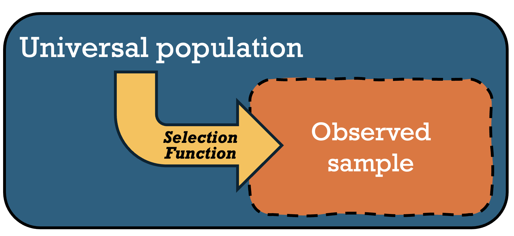
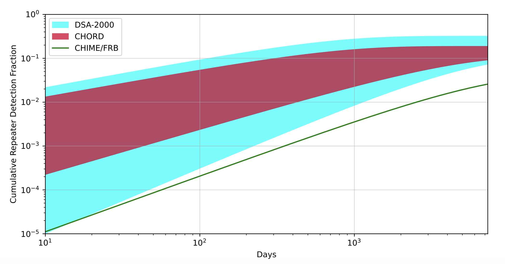
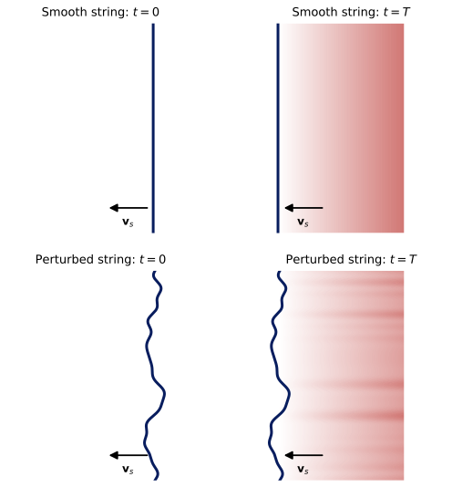

# Projects

Research projects in transient astrophysics, survey science, and statistical inference.

  <article class="project-card">
    

      
01 · Survey selection

      <h2 id="frb-survey-selection">Measuring observational bias in real-time FRB surveys</h2>
      
Triggered surveys <strong>do not observe every burst equally</strong>. I model how detection thresholds, real-time triggering, and instrumental sensitivity transform an <strong>intrinsic FRB population</strong> into an observed sample.

      
<strong>Goal</strong> Build population analyses that carry survey selection effects through to the final inference.

    

    <figure class="project-figure">
      
      <figcaption>Selection functions connect the underlying population to detected events.</figcaption>
    </figure>
  </article>

  <article class="project-card project-card--reverse">
    

      
02 · FRB populations

      <h2>Unifying repeating and apparent non-repeating FRBs</h2>
      
Some FRB sources repeat while many have been observed only once. This project tests whether those groups can arise from a <strong>shared underlying population</strong> after accounting for observing cadence, source activity, and the probability of detecting another burst.

      
<strong>Question</strong> When does a source appear to be a one-off because of its physics, and when because of how it was observed?

    

    <figure class="project-figure">
      
      <figcaption>Forecasting how repeater detections grow with survey time and sensitivity.</figcaption>
    </figure>
  </article>

  <article class="project-card">
    

      
03 · Early-Universe constraints

      <h2>Forecasting cosmic-string limits with radio transient surveys</h2>
      
Radio transient surveys can test <strong>models of the early Universe</strong>. I develop forecasts for how next-generation facilities may <strong>constrain cosmic-string populations</strong> through their predicted transient signatures.

      
<strong>Approach</strong> Translate survey design and null results into robust upper limits on cosmic-string models.

    

    <figure class="project-figure">
      
      <figcaption>Illustration of density wakes from smooth and perturbed cosmic strings.</figcaption>
    </figure>
  </article>

